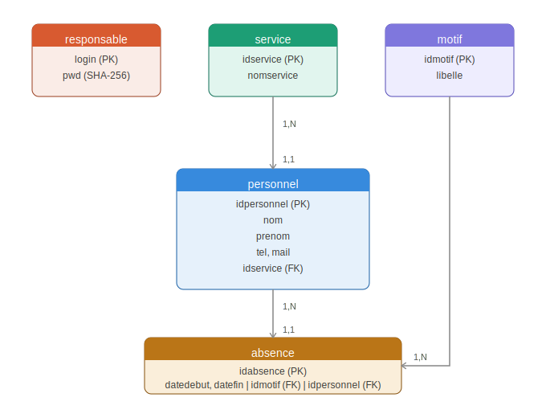
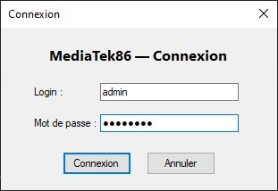
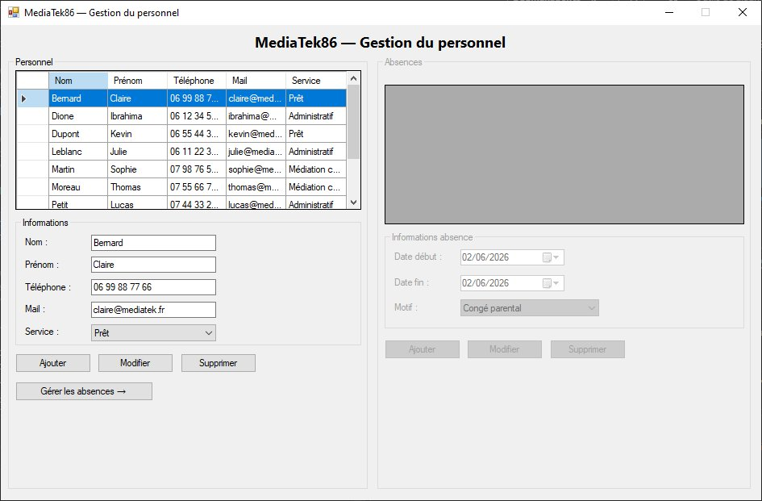
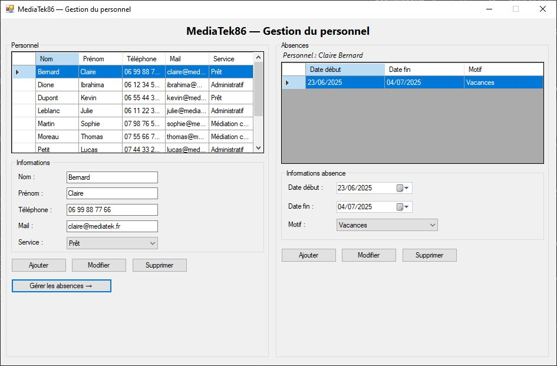
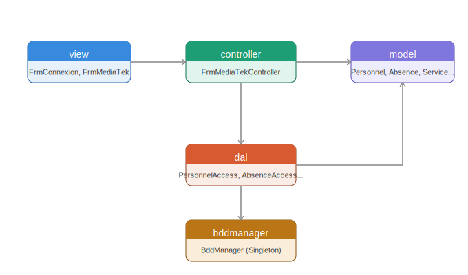

# MediaTek86
Application C# écrite sous Visual Studio 2022 et exploitant une BDD MySQL.  
<strong>Important :</strong> 
Avant de lancer l'application, s'assurer que MySQL est démarré et que le script SQL a été exécuté. 
Les identifiants de connexion par défaut sont : login <code>admin</code> / mot de passe <code>Admin123</code>. 
La chaîne de connexion se trouve dans le fichier <code>App.config</code> du projet.

## Présentation de l'application
### But de l'application
La médiathèque MediaTek86 a besoin d'un outil de gestion de son personnel et des absences associées. Les membres du personnel sont rattachés à des services (Administratif, Médiation culturelle, Prêt). Pour chaque membre, il est possible d'enregistrer des absences motivées (congé parental, maladie, motif familial, vacances). L'accès à l'application est sécurisé par une authentification du responsable. 
L'application MediaTek86 représente cet outil de gestion.

### Structure de la BDD
Voici la structure de la BDD au format MySQL : 

La base contient 5 tables :
- **responsable** : login, pwd (SHA-256)
- **service** : idservice, nomservice
- **motif** : idmotif, libelle
- **personnel** : idpersonnel, nom, prenom, tel, mail, idservice
- **absence** : idabsence, datedebut, datefin, idmotif, idpersonnel

### Interface et fonctionnalités
Voici la fenêtre de connexion de l'application : 

 
Voici la fenêtre principale de gestion du personnel : 

 
Voici la gestion des absences d'un membre du personnel : 

 
L'application permet de : 
. présenter la liste du personnel (nom, prénom, téléphone, mail, service) ; 
. ajouter, modifier ou supprimer un membre du personnel ; 
. gérer les absences d'un membre sélectionné (ajout, modification, suppression) ; 
. contrôler les chevauchements d'absences (une absence ne peut pas être ajoutée si le créneau est déjà occupé) ; 
. sécuriser l'accès par une authentification avec mot de passe chiffré en SHA-256.

### Diagramme de paquetage
L'application est structurée dans le respect du pattern MVC. 

#### Explications sur les couches supplémentaires
L'application contient 2 paquetages supplémentaires par rapport au MVC classique : 
. **bddmanager** : contient la classe qui permet d'accéder à la base de données MySQL et d'exécuter les requêtes (classe indépendante et réutilisable). 
. **dal** (Data Access Layer) : répond aux demandes du paquetage 'controller' et exploite 'bddmanager' en lui demandant d'exécuter des requêtes. 
L'avantage de cette architecture est l'isolement de la connexion (bddmanager) par rapport au reste de l'application. Le contrôleur ne sait pas d'où viennent les données. Le paquetage 'dal' fait l'intermédiaire en préparant des requêtes SQL. 
Changer de SGBDR reviendrait à juste modifier la classe BddManager, sans toucher au reste de l'application.

#### Présentation du cheminement
L'application démarre sur la vue de connexion. Une fois authentifié, la vue principale est chargée. 
La vue crée une instance du contrôleur principal (FrmMediaTekController). Quand elle a besoin d'accéder aux données, elle fait appel à ce contrôleur. 
Le contrôleur fait appel aux classes de la couche 'dal' pour exécuter les demandes de la vue. 
Les classes de la couche 'dal' contiennent les requêtes SQL et sollicitent la couche 'bddmanager' pour les exécuter. 
Chaque classe de la couche 'dal' est liée à une classe métier contenue dans 'model'. Ces classes correspondent aux tables de la base de données et ne contiennent que la structure des données (propriétés, getters, setters).

## Etapes de construction
Les différents commits montrent la création de l'application étape par étape.

### Commit "Initialisation de la structure MVC du projet"
La structure de l'application est créée (les paquetages et classes vides), dans le respect du diagramme de paquetage. 
L'application n'est pas encore opérationnelle.

### Commit "Ajout de la couche modèle (Personnel, Absence, Service, Motif)"
Les classes métier du paquetage 'model' sont créées : Personnel, Absence, Service, Motif. 
Chaque classe correspond à une table de la base de données et contient les propriétés et accesseurs nécessaires.

### Commit "Ajout du gestionnaire de connexion à la base de données"
La classe BddManager (singleton) est complétée. Elle permet de se connecter à MySQL et d'exécuter des requêtes SELECT et UPDATE de manière paramétrée.

### Commit "Ajout de la couche DAL - accès aux données (Personnel, Absence, Service, Motif)"
Les classes d'accès aux données sont créées : PersonnelAccess, AbsenceAccess, ServiceAccess, MotifAccess, ResponsableAccess. 
Chaque classe contient les requêtes SQL nécessaires aux opérations CRUD sur la table correspondante.

### Commit "Ajout du contrôleur principal (FrmMediaTekController)"
Le contrôleur principal est codé. Il fait le lien entre les vues et les classes DAL, en exposant les méthodes nécessaires à la gestion du personnel et des absences.

### Commit "Ajout de la vue de connexion sécurisée (SHA-256)"
La fenêtre de connexion est créée. Elle chiffre le mot de passe saisi en SHA-256 avant de le vérifier en base de données.

### Commit "Ajout de la vue principale et gestion CRUD du personnel"
La fenêtre principale est créée avec la liste du personnel et les boutons Ajouter, Modifier, Supprimer. 
Les saisies sont validées (nom, prénom et mail obligatoires, confirmation avant modification ou suppression).

### Commit "Ajout de la gestion des absences et contrôle des chevauchements"
Le panneau de gestion des absences est intégré à la vue principale. 
Un contrôle de chevauchement est effectué côté BDD avant chaque ajout ou modification : si le créneau est déjà occupé pour ce personnel, l'opération est refusée et un message d'avertissement est affiché.

### Commit "Ajout du script SQL complet (tables, insertions, utilisateur BDD)"
Le fichier mediatek86.sql est finalisé. Il contient la création de la base, des tables avec clés étrangères, la création de l'utilisateur applicatif (userMediatek / mdpMediatek) avec les droits nécessaires, et des données de test (10 personnels, 12 absences).

### Commit "Création de l'installateur MSI pour le déploiement"
Un projet d'installation Visual Studio (Setup Project) est créé. Il génère un fichier setup.exe et un fichier .msi permettant d'installer l'application sur un autre poste.

## Installation
Pour tester l'application, il faut d'abord installer les outils suivants : 
. SGBDR MySQL (par exemple en installant WAMP ou un logiciel similaire) 
. Visual Studio 2022 (ou exécuter directement setup.exe pour une installation sans IDE) 
Il faut ensuite : 
. Dans MySQL, exécuter le script <code>mediatek86.sql</code> (présent en racine du dépôt) pour créer et remplir la BDD. 
. Lancer <code>mediatek86-installer/Debug/setup.exe</code> pour installer l'application, ou ouvrir la solution dans Visual Studio et exécuter le projet. 
. Se connecter avec le login <code>admin</code> et le mot de passe <code>Admin123</code>.

## Auteur
El Hadj Ibrahima Dione — BTS SIO SLAM CNED
